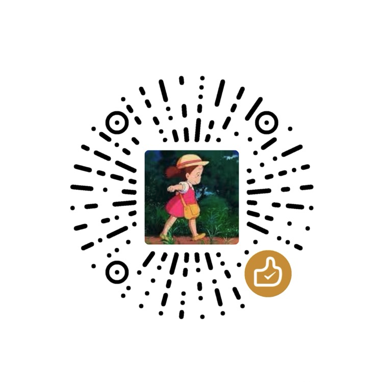

# vocabulary-book-by-deepseek

使用 DeepSeek 开发实现的四六级、考研、托福 单词词库手册， 提供单词的词义、词根、例句、辅助记忆、助记图像等信息。

本项目 80% 以上代码采用 Cline + DeepSeek-R1-16b(本地部署) 自动编码完成。

生成的词库手册最终效果如下：

- [小智晖的AI单词库](https://word.vxiaozhi.com/)
  - [初中词汇](https://word.vxiaozhi.com/2025/02/11/junior-a/)
  - [高中词汇](https://word.vxiaozhi.com/2025/02/11/senior-a/)
  - [四级词汇](https://word.vxiaozhi.com/2025/02/11/cet4-a/)
  - [六级词汇](https://word.vxiaozhi.com/2025/02/11/cet6-a/)
  - [考研词汇](https://word.vxiaozhi.com/2025/02/11/postgrad-a/)
  - [托福词汇](https://word.vxiaozhi.com/2025/02/11/toefl-a/)


## 功能规划

- ✅ 英语四级词库
- 英语六级词库
- 考研
- 托福
- 生成anki卡片
- 生成PDF

## Run

**cet4 原始单词数据路径：**

```
data/cet4/
```

**调用DeepSeek生成单词解释信息**

- 串行处理

```
./prun.sh process_words.py
```

- 只处理一个文件

```
./prun.sh process_words.py a
```

- 并发处理所有文件

```bash
for letter in {a..z}; do 
    ./prun.sh process_words.py ${letter} &
    sleep 10
done
```

**生成每个单词的助记图像**

```
./prun.sh gen_words_img.py
```

**生成文章**

```
./prun.sh gen_articles.py
```

**本地启动**

```
./scripts/run_local.sh
./start.sh
```

## Cline任务

本项目 80% 以上代码采用 Cline + DeepSeek-R1-16b(本地部署) 自动编码完成。

-  [Cline 任务提示词记录在此](docs/cline_tasks.md)

## 数据来源

- [四级单词库](https://github.com/cuttlin/Vocabulary-of-CET-4)
- [六级单词库](https://github.com/KyleBing/english-vocabulary)

## 赞赏

作为一个独立开发者，除了日常的代码开发工作外，项目运行所需的各项成本（包括调用大模型的费用）均由我个人承担。

如果您觉得我的项目对您有所帮助，请通过下方式支持我：

- **捐赠支持：** 若有意向提供捐助，感谢您的鼓励与支持！
- **扫码交流群：** 欢迎加入我们的讨论社群，共同探讨如何更高效地学习英语、记忆单词，以及AI在语言学习中的应用。


|||
|:-:|:-:|
|后台回复 `AI助记` 加群交流|捐赠支持作者|

