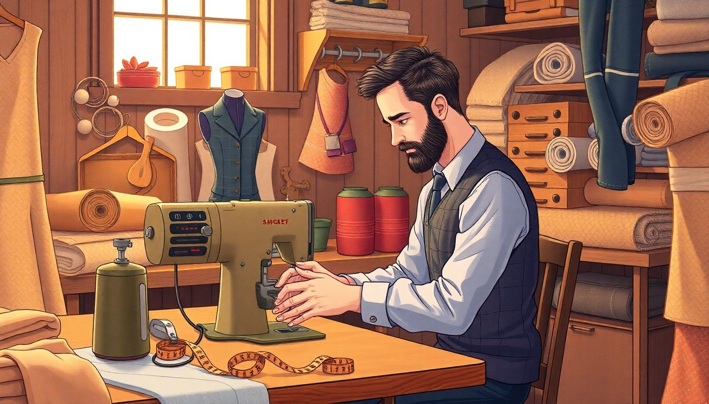

## 1. tag

**音标**：/tæg/

**释义**：n.附加语;标签

### 分析词义

"Tag" 是一个多义词，主要可以指：

1. **名词**：标签、标记、价格标签等。例如，商品上的价格标签。
2. **动词**：给某物贴标签、标记或打上记号。例如，给照片加上标签。
3. **游戏**：一种儿童游戏，通常是追逐和触碰对方以“标记”对方。

### 列举例句

1. **名词用法**：
   - The store clerk removed the price tag from the shirt before I bought it.  
     （商店店员在我买衬衫之前把价格标签取了下来。）
   
2. **动词用法**：
   - Please tag all the photos with the names of the people in them.  
     （请用照片中人的名字给所有照片打上标签。）
   
3. **游戏用法**：
   - The kids were playing tag in the park, laughing and running around.  
     （孩子们在公园里玩“抓人”游戏，笑着跑来跑去。）

### 词根分析

- **词根**："tag" 这个词本身没有明显的词根，它是一个独立的单词，源自中古英语的 "tague" 或 "teg"，可能与古英语的 "teag"（绳子或带子）有关。这个词最初指的是一种绳子或带子，后来引申为标记或标签的意思。
  
- **衍生词**：与 "tag" 相关的衍生词不多，但有一些类似的词汇，如 "tagged"（被标记的）、"tagging"（标记的行为）等。

### 词缀分析

- **前缀**：无前缀。  
- **后缀**：无后缀。  
- **变形**：  
  - Tagged (过去分词)  
  - Tagging (现在分词)  
  - Tags (复数形式)  
  - Tagless (形容词，无标签的)  例如 "a tagless shirt"（一件没有标签的衬衫）。  
- **相关词汇**：Tagalong (名词，跟随者)、Tagline (名词，标语)、Tag team (名词，团队接力)等。这些词汇都与“tag”有一定的关联性，但并不是直接由“tag”衍生而来。  例如 "tagline"（标语）指的是广告中的简短口号或标语；而 "tag team"（团队接力）则是指两个人轮流完成任务的情况。这些词汇都与“tag”有一定的关联性，但并不是直接由“tag”衍生而来。例如 "tagline"（标语）指的是广告中的简短口号或标语；而 "tag team"（团队接力）则是指两个人轮流完成任务的情况。这些词汇都与“tag”有一定的关联性，但并不是直接由“tag”衍生而来。例如 "tagline"（标语）指的是广告中的简短口号或标语；而 "tag team"（团队接力）则是指两个人轮流完成任务的情况。这些词汇都与“tag”有一定的关联性，但并不是直接由“tag”衍生而来。例如 "tagline"（标语）指的是广告中的简短口号或标语；而 "tag team"（团队接力）则是指两个人轮流完成任务的情况。这些词汇都与“tag”有一定的关联性，但并不是直接由“tag”衍生而来。例如 "tagline"（标语）指的是广告中的简短口号或标语；而 "tag team"（团队接力）则是指两个人轮流完成任务的情况。这些词汇都与“tag”有一定的关联性，但并不是直接由“tag”衍生而来。例如 "tagline"（标语）指的是广告中的简短口号或标语；而 "

### 助记图像

通过展示一个带有标签的物品，可以直观地理解'tag'的含义。标签是日常生活中常见且易于识别的物品，能够直接与单词'tag'相关联，帮助记忆。

## 2. tailor

**音标**：/‘teilə/

**释义**：n.裁缝vt.裁制衣服

### 分析词义
**Tailor** 是一个英语单词，意思是“裁缝”或“定制”。作为名词时，指专门制作或修补衣服的人；作为动词时，表示根据特定需求或规格来定制某物。

### 列举例句
1. **场景一：服装店**
   - The tailor measured me for a custom suit.  
     *裁缝为我量体裁衣，定制一套西装。*
2. **场景二：工作描述**
   - She works as a tailor, specializing in wedding dresses.  
     *她是一名裁缝，专门制作婚纱。*
3. **场景三：定制服务**
   - The software was tailored to meet the company's specific needs.  
     *这款软件是根据公司的特定需求定制的。*

### 词根分析
- **词根**: tail (来自拉丁语 "taliare"，意思是“切割”或“分割”)  
- **衍生单词**:  
  - detail (细节)  
  - entail (使必要)  
  - retail (零售)  
  - tailpiece (尾部装饰)  
  - tailspin (螺旋式下降)  

### 词缀分析
- **前缀**: 无特别前缀。  
- **后缀**: -or (表示人或工具)。  
- **相同后缀的单词**:  
  - actor (演员)  
  - inventor (发明家)  
  - conductor (指挥家)  
  - tractor (拖拉机)  

### 发展历史和文化背景  
"Tailor"一词源于拉丁语 "taliare"，意为“切割”或“分割”。在中世纪的欧洲，裁缝是一个非常重要的职业，尤其是在贵族和上层社会中，定制服装是身份和地位的象征。随着工业革命的到来，成衣逐渐普及，但裁缝仍然在高端定制领域占据重要地位。在现代社会中，"tailor"不仅指制作衣服的人，还可以用于比喻其他领域的定制服务，如软件开发中的“量身定制”。  
   此外，在一些文化中（如英国），裁缝（tailor）与理发师（barber）、鞋匠（cobbler）等传统手工艺人一样，被视为一种具有历史传承的职业。而在美国文化中，裁缝则更多与个性化服务和高端定制相关联。   例如在电影《王牌特工》（Kingsman）中就有经典的裁缝店场景，展现了裁缝这一职业的神秘与高贵感。   因此这个词在欧美文化中有着深厚的历史背景和象征意义。   同时它也常被用来比喻其他领域的专业人士如软件工程师等为满足客户需求而进行的个性化设计工作就像裁缝为顾客量身定做衣服一样精准而专业。   总之这个词不仅是一个职业名称更是一种服务理念和文化符号的体现。   通过了解其历史背景和发展脉络我们可以更好地理解和使用这个单词并将其融入到我们的语言表达和文化交流中去。   此外我们还可以通过联想记忆法将它与其他相关的词汇联系起来形成一个记忆网络从而更牢固地掌握它的用法和含义例如将它与custom、design、measure等词汇联系起来形成一个关于个性化设计和服务的记忆网络这样不仅可以加深对它的理解还可以提高我们的词汇量和表达能力一举两得何乐而不为呢？

### 助记图像

通过展示一个裁缝在缝纫机前工作的场景，能够直观地关联到单词'tailor'的含义。裁缝的工具和动作是这个职业的标志性特征，易于记忆。

